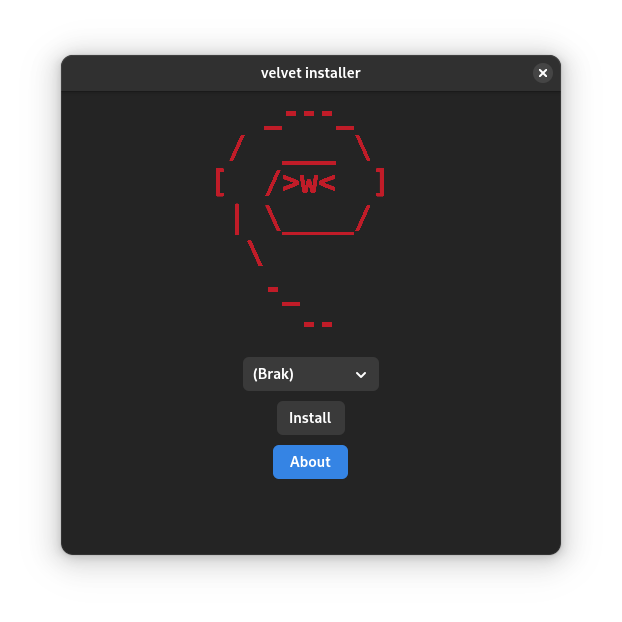

# The installation script

In this approach we do not dump the image file onto the emmc but instead simply sync the contents of the running system onto newly created filesystems on the emmc. the advantages over legacy dd installation are:

- Internet not required - no network connection required and the running system has everything required.
- Ability to preconfigure - the running image can already be a bit preconfigured and all changes to it will also be synced to emmc (maybe useful when installing on multiple identical systems)
- No uuid conflict - the filesystems on the emmc will get new filesystem uuids and also the labels of the filesystems can be easily adjusted, so no risk of a conflict with a booted rescue system from sd card/usb
- Simpler than regular installation
- **Only arm64 chromebooks supported**
- This script is **for debian testing/trixie images** and above (won't work propertly on bookworm or buster)

### Important

_Warning. if you don't want you system becoming unbootable in the future, **before proceeding** with installation it is recommended to **first [set gbb flags](../setting_gbb_flags.md)** (you can't do this after the installation)_

_Remember. these steps have to be done from [linux booted from usb](../readme.md), not chromeos_

## Introduction

As of version 0.7.7 [velvet tools](https://github.com/velvet-os/velvet-tools) includes the ```vtinstall``` command

Before proceeding with the installation **make sure** you have the **latest version** with the following command:

```
sudo apt update
sudo apt full-upgrade
```

#### If your system doesn't come with velvet tools installed:

You can get .deb version from https://github.com/velvet-os/velvet-tools/releases

or

Install them via [velvet-repo](https://gitlab.com/velvet-os/velvet-repo)

```
#add public key
curl -sS https://repo.velvet-os.org/repo/velvet_repo.asc | sudo tee -a /etc/apt/trusted.gpg.d/velvet_repo.asc
#add source
echo "deb [arch=arm64,all] https://repo.velvet-os.org/repo stable main" | sudo tee /etc/apt/sources.list.d/velvet_repo.list
#fetch repo content
sudo apt update
#installe velvet tools
sudo apt install velvet-tools
```

## Installation process

1. Start by listing all possible installation devices

```
vtinstall
```

2. Run the following command to install

```
sudo vtinstall [device]
```

_Warning. make sure your device doesn't go into suspend mode, this might disrupt the installation._

_Tip. Replace [device] with device you want to install onto like sda or mmcblk0 or mmcblk1_

The script should prompt you for confirmation
and after that everything should just happen.

After the script has finished just restart the device and everything should **just work**.

#### If you encounter any issue with the script

Please report them [here](https://github.com/velvet-os/velvet-tools/issues)

## Graphical installation (proof-of-concept)

There exists a *poc* graphical wrapper around this command,

which serves the exact same purpose as ```vtinstall``` and is just a fancy wrapper around it.



_Note. it will look a bit different on the current default desktop due to theming difference._

https://github.com/thenameisluk/velvet-installer

You can install it via velvet repo (look above on adding velvet repo).

```
sudo apt install velvet-installer
```

Once installed, it should be available in applications menu.

_Warning. Again make sure your device doesn't go into suspense during the installation, this might disrupt the installation._

#### If you encounter any issue with the graphical installer

Please report them [here](https://github.com/thenameisluk/velvet-installer/issues)

Keep in mind this is just a Proof-of-Concept
