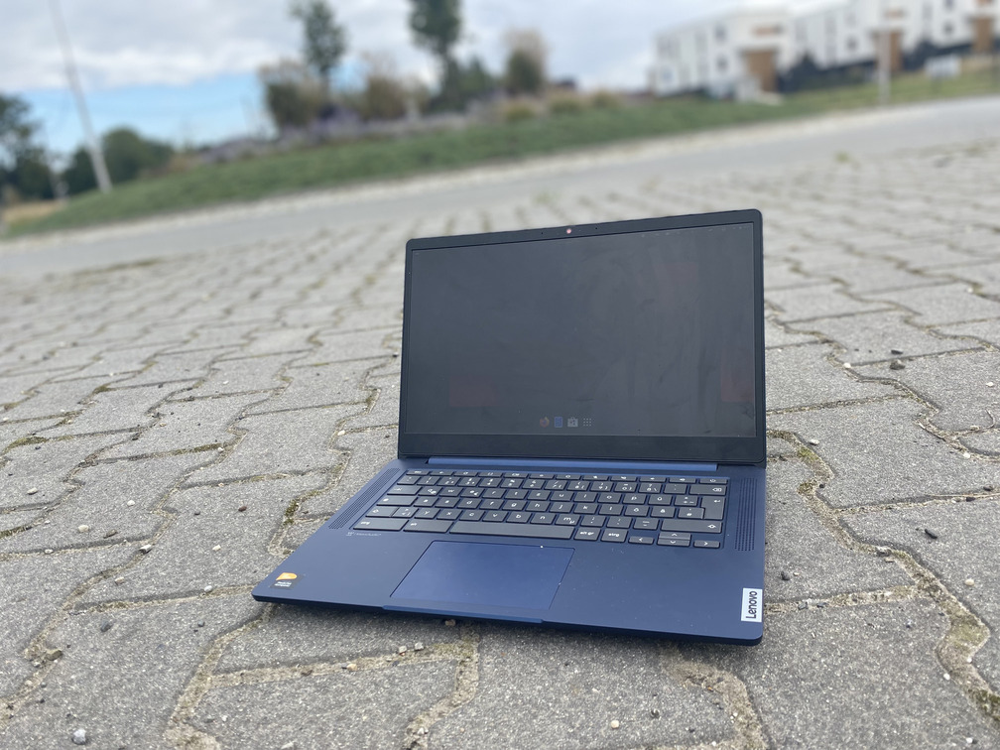

# Lenovo chromebook slim 3 (magneton)

Kernel Version: 6.12.36-stb-cbm+

### Features table
```diff
Basic
+ Internal storage
+ Battery
+ Screen
Peripheria
+ Keyboard
+ Camera
Audio
+ Speaker
+ Headphones
Connectivity
+ Wifi
+ Bluetooth
Connectors
+ USB
+ USB-C
+ USB-C to HDMI/DP
+ SD Reader
Other
? Hardware encoding
? Hardware decoding
+ 3D acceleration (Panfrost OpenGL ES 3.1/OpenGL 3.1)
```

### Notes

**Bluetooth**
seams to work in the current kernel

**Audio**
seams to work on the current kernel

**Suspense**
adding
```
echo 65535 > /sys/kernel/debug/cros_ec/suspend_timeout_ms
```
to ```/etc/rc.local``` seams to fix the issue

# Other

- [issues](https://github.com/hexdump0815/imagebuilder/issues/228)
- [system notes](https://github.com/hexdump0815/imagebuilder/blob/main/systems/chromebook_corsola/readme.md)
