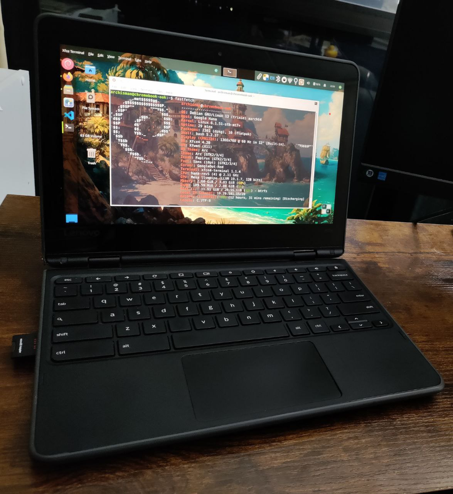

# Lenovo 300e gen2 Mediatek (hana)

Kernel Version: 6.1.51-stb-mt7+

### Features table
```diff
Basic
+ Internal storage
+ Battery
+ Screen
+ Touchscreen
Peripheria
+ Keyboard
+ Touchpad
+ Camera
+ Gyroscope (see notes)
Audio
+ Speaker
+ jack
Connectivity
+ Wifi
+ Bluetooth
Connectors
+ USB
+ SD Card reader
- HDMI
Other
? Hardware encoding
? Hardware decoding
- 3D acceleration (only software rendering for now)
```

### Notes

- Gyroscope does not work on Debian Trixie due to a [bug](https://gitlab.freedesktop.org/hadess/iio-sensor-proxy/-/issues/411) in `iio-sensor-proxy`. You can manually build [this patch](https://gitlab.freedesktop.org/hadess/iio-sensor-proxy/-/merge_requests/400) to fix it, and the gyroscape should work afterward.
- In XFCE, you'll have to enable the Chromebook keyboard layout for function keys to work.
  
# Other

- [issues](https://github.com/hexdump0815/imagebuilder/issues/271)
- [system notes](https://github.com/hexdump0815/imagebuilder/blob/main/systems/chromebook_oak/readme.md)
