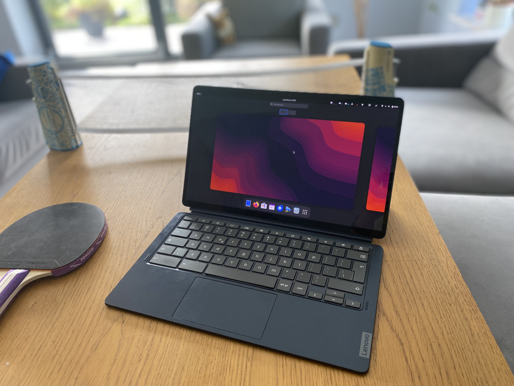

# Getting started using the images

You can start by simply [flashing image onto your USB/SD (not just copy!)](./flashing.md)

_Tip. You can find the images [here](../readme.md)_

_**Remember.** The default username/password to login is: linux/changeme_

### Installation/Booting:

- [Chromebooks](./chromebooks/readme.md)
- [Consoles](./console/readme.md)
- [Other devices](https://github.com/hexdump0815/imagebuilder/tree/main)

_Tip. After booting there is an onscreen keyboard available via top menu on the login screen and the onboard onscreen keyboard is available in the XFCE session (the four little squares in right part of the menubar)._

### Device specific:

- [Chromebooks](./chromebooks/systems/readme.md)
- [Consoles](./console/systems/readme.md)

### Additional documentation:

- [First Boot](./first-boot.md)
- [After installation](./postinst/readme.md)
- [Handling chromebook kernel](./chromebooks/kernel/readme.md)

_Note. Another good source of information are the already existing github issues of this repository, as quite a few topics and problems were discussed there already. The top level search of github restricted to "this repository" or the search box of the issues (best searching across open and closed issues) seems to work well for searching what is there._
