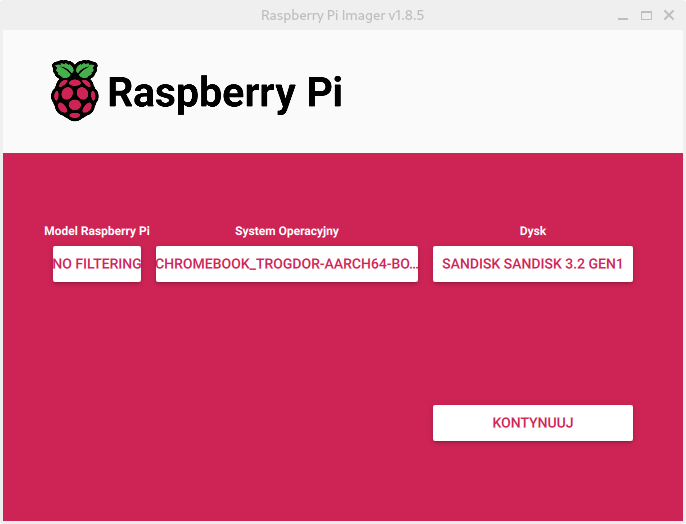

# Preparing USB medium

_Important. Simply copying image onto an USB is not a correct way of doing it, so please don't do it and then open issues about it not working._

<details><summary>

### If your USB/SD card was cheap please read this:

</summary>

These kinds of devices tend to report fake capacity,
which might cause issues with system flashed on them.

Please check it's real capacity with [f3 tools](https://fight-flash-fraud.readthedocs.io/en/latest/introduction.html)
or similar.

</details>

## Flashing on Chromebook or Linux:

Download the image, you can find image for your specific device [here](./images-master.md)

Find the name.img.gz (it can be skipped if you already know the file location)

```
find / -name *.img.gz 2> /dev/null
```

_Note. ```2> /dev/null``` is for avoiding throwing useless errors and can be removed._

Then, cd to the directory:

```
cd path/to/dir
```

Unpack the image:

```
gunzip name.img.gz
```

Find your USB device:

```
lsblk
```

_Output:_

```
luk@chluk /mnt $ lsblk
NAME         MAJ:MIN RM   SIZE RO TYPE MOUNTPOINTS
mtdblock0     31:0    0     8M  0 disk 
sda      179:0    0 116,5G  0 disk <-- your usb
├─sda1  179:1    0    32M  0 part <-- partition
├─sda2  179:2    0    32M  0 part 
├─sda3  179:3    0   512M  0 part /boot
├─sda4  179:4    0 108,5G  0 part /
└─sda5  179:5    0   7,5G  0 part [SWAP]
```

_Tip. Just find a device with same size as your USB._
_Note. You can also run the command before and after plugging in the device to be sure._

_Note. Your partitions might be different._

Flash the image:

```
sudo dd status=progress if=name.img of=/dev/<target-device>
```

_Note. Replace <target-device> with your USB name from the step above, Note that it needs to be the sda part, not the sda1 part._
_Warning. This operation will wipe your SD/USB drive._

Your USB should be ready to go 🎉

_Note. if there is any problem with any command just add sudo before it_

## Flashing on any other system

For simplicity just use [Raspberry Pi imager](https://www.raspberrypi.com/software)



If you use different software you are on your own, it should work but **do not create an issue about it not working.**

_Note. For most you will need to unpack name.img.gz file using archive tool._
