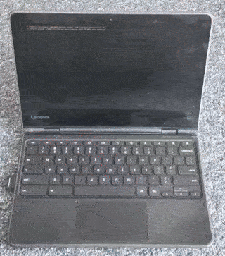

# Installing a Plymouth Theme




Note: This guide only works with the Debian Trixie (and perhaps later) images.

0. **Install a Plymouth theme** (you can search for it in your favorite search engine), and follow these steps:

1. **Set the theme:**

   ```bash
   sudo plymouth-set-default-theme [theme-name]
   ```

2. **Rebuild the initramfs:**

   ```bash
   sudo update-initramfs -u
   ```

3. **Flash the kernel** (if auto flash is disabled; it's not by default):

   ```bash
   sudo vtflash
   ```
   or

   ```bash
   sudo vttest
   ```
   (for one-time boot)

Also, we recommend adding all these options to cmdline (in `/boot`) for best results:

```
quiet splash plymouth.ignore-serial-consoles loglevel=0
```
